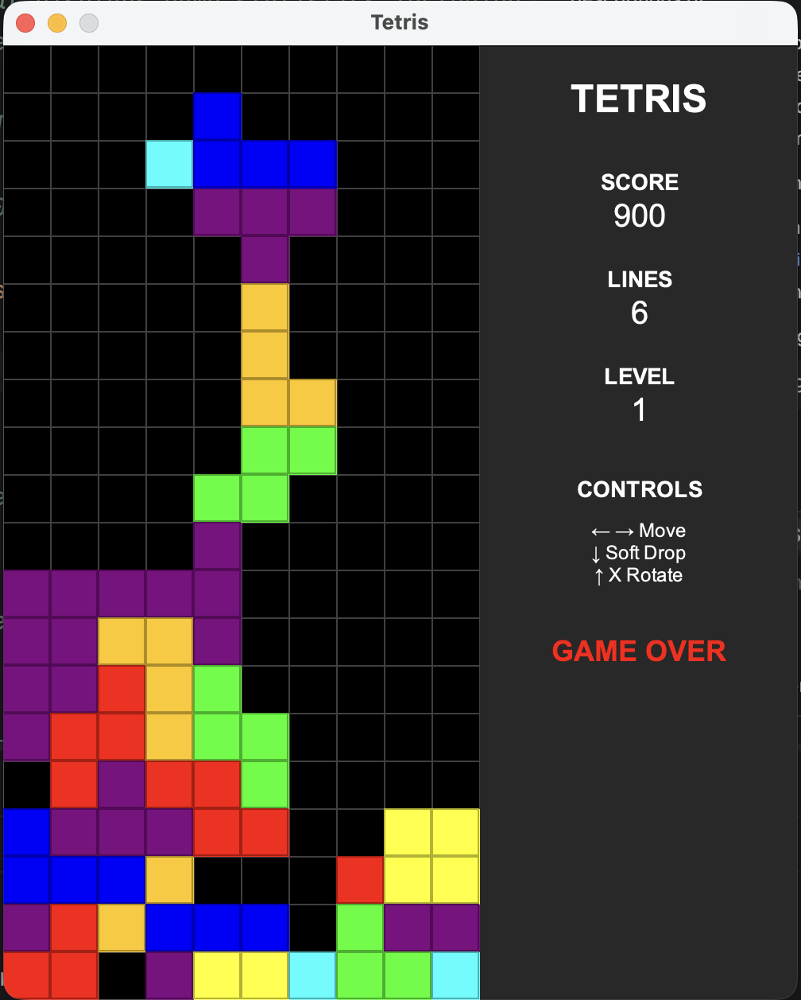

# Tetris - User Guide



*Classic Tetris gameplay with real-time scoreboard*

## Table of Contents
- [Getting Started](#getting-started)
- [Game Interface](#game-interface)
- [How to Play](#how-to-play)
- [Controls](#controls)
- [Scoring System](#scoring-system)
- [Game Features](#game-features)
- [Tips and Strategies](#tips-and-strategies)

---

## Getting Started

### Installation and Running

1. **Prerequisites**: Ensure you have Java 17 or higher installed
2. **Run the game**:
   ```bash
   mvn exec:java -Dexec.mainClass="tech.habegger.tetris.Main"
   ```
   Or build and run the JAR:
   ```bash
   mvn clean package
   java -jar target/tetris-1.0-SNAPSHOT.jar
   ```

3. The game window will open automatically

---

## Game Interface

The game window consists of two main sections:

### Left Side - Game Board (300x600 pixels)
- **10 columns × 20 rows** grid
- Black background with dark gray grid lines
- Colored tetromino pieces (current falling piece + locked pieces)
- Each cell is 30×30 pixels

### Right Side - Scoreboard Panel (200x600 pixels)
- **TETRIS** - Game title
- **SCORE** - Current score (starts at 0)
- **LINES** - Total lines cleared (starts at 0)
- **LEVEL** - Current level (starts at 1, increases every 10 lines)
- **CONTROLS** - Quick reference guide
- **GAME OVER** - Red message when game ends

---

## How to Play

### Objective
Stack falling tetromino pieces to create complete horizontal lines. When a line is completed, it disappears and you earn points. The game ends when pieces stack up to the top of the board.

### Game Flow
1. A random tetromino piece spawns at the top center of the board
2. The piece automatically falls down one row every 0.5 seconds
3. Use controls to move and rotate the piece before it locks
4. When the piece reaches the bottom or lands on another piece, it locks in place
5. Complete horizontal lines disappear and award points
6. A new piece spawns and the cycle continues
7. Game ends when a new piece cannot spawn (board is full)

---

## Controls

| Key | Action |
|-----|--------|
| **←** (Left Arrow) | Move piece left |
| **→** (Right Arrow) | Move piece right |
| **↓** (Down Arrow) | Soft drop (move down faster) |
| **↑** (Up Arrow) or **X** | Rotate piece clockwise |

### Control Tips
- You can hold down the arrow keys for continuous movement
- Rotation is validated - if a rotation would cause a collision, it's automatically cancelled
- Soft drop speeds up descent but doesn't instantly drop the piece

---

## Scoring System

Points are awarded based on the number of lines cleared simultaneously:

| Lines Cleared | Points Awarded | Name |
|---------------|----------------|------|
| 1 line | 100 points | Single |
| 2 lines | 300 points | Double |
| 3 lines | 500 points | Triple |
| 4 lines | 800 points | **Tetris** |

### Level Progression
- **Level = (Lines Cleared ÷ 10) + 1**
- Example: 0-9 lines = Level 1, 10-19 lines = Level 2, etc.
- Currently, level is for display only (future versions may increase speed)

---

## Game Features

### All 7 Classic Tetromino Pieces

Each piece has a unique shape and color:

1. **I-piece** (Cyan) - Straight line, 4 blocks
2. **O-piece** (Yellow) - Square, 2×2 blocks
3. **T-piece** (Purple) - T-shape, 4 blocks
4. **S-piece** (Green) - S-shape, 4 blocks
5. **Z-piece** (Red) - Z-shape, 4 blocks
6. **J-piece** (Blue) - J-shape, 4 blocks
7. **L-piece** (Orange) - L-shape, 4 blocks

### Sound Effects

The game includes audio feedback for key events:

- **Single beep** (100ms, 800Hz) - Piece locks at bottom
- **Double beep** (80ms, 1000Hz + 1200Hz) - Line(s) cleared
- **Descending beeps** (800Hz → 600Hz → 400Hz) - Game over

### Visual Feedback

- Each piece has a distinct color
- Locked pieces remain visible on the board
- Grid lines help with alignment
- "GAME OVER" message appears in red when game ends

---

## Tips and Strategies

### For Beginners
1. **Take your time** - The piece falls every 0.5 seconds, giving you time to think
2. **Avoid gaps** - Try to stack pieces without leaving empty spaces
3. **Use the walls** - Slide pieces along the walls for precise placement
4. **Plan ahead** - Think about where the next piece will go

### Advanced Techniques
1. **Save the I-piece** - Try to clear 4 lines at once (Tetris) for maximum points
2. **Build flat** - Keep the top of your stack as level as possible
3. **Create wells** - Leave a vertical gap for I-pieces to score Tetrises
4. **Rotate early** - Rotate pieces while they're falling to save time

### Common Mistakes to Avoid
- ❌ Stacking too high too quickly
- ❌ Creating unreachable gaps
- ❌ Ignoring the sides of the board
- ❌ Not using soft drop when needed

---

## Troubleshooting

### Game won't start
- Ensure Java 17+ is installed: `java -version`
- Check that Maven is installed: `mvn -version`
- Try rebuilding: `mvn clean compile`

### No sound
- Sound uses Java's AudioSystem - ensure your system audio is working
- Sound may not work on headless systems (servers without audio)

### Game runs too slow/fast
- Current speed is fixed at 500ms per tick
- Future versions may add adjustable difficulty

---

## Game Over

When the game ends:
1. "GAME OVER" appears in red on the scoreboard
2. Descending beep sounds play
3. The game stops accepting input
4. Your final score and lines cleared remain visible
5. Close the window to exit

To play again, restart the application.

---

**Enjoy playing Tetris!** 🎮

For technical documentation, see [README.md](README.md)  
For development guidelines, see [AGENTS.md](AGENTS.md)  
For project roadmap, see [PLAN.md](PLAN.md)

